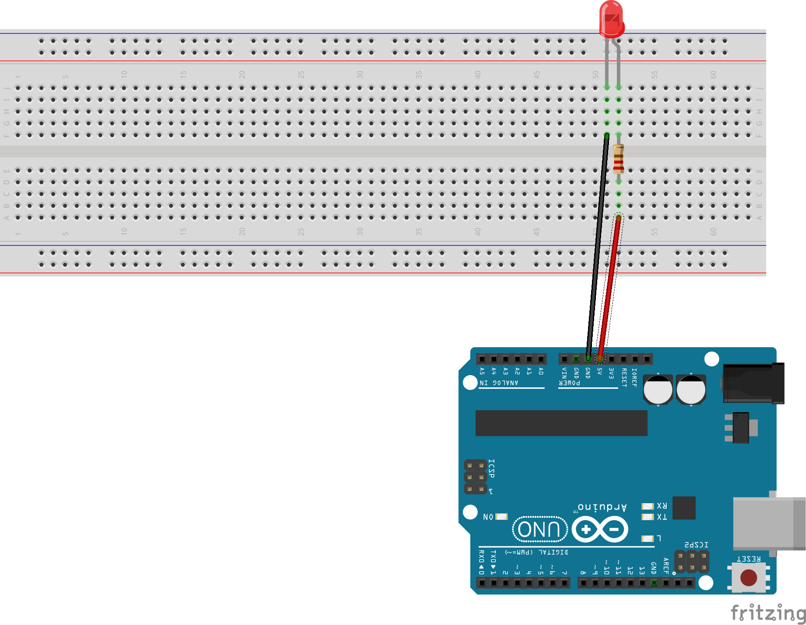

## Grundlagen 2 - LED anschließen

Nun wollen wir herausfinden, wie man eine externe LED anschließen kann. Dazu braucht Ihr folgende Bauteile:

**LED**  
LED ist ein Akronym, das für *Light Emitting Diode* steht. LEDs könnenLicht produzieren, wenn man einen Strom an sie anlegt. Dabei ist es jedoch wichtig in welche Richtung man sie anschließt (Durchlassrichtung &rarr; LED leuchtet, Sperrichtung &rarr; LED leuchtet nicht). Den Pluspol schließt man bei einer LED immer an das lange Beinchen, den Minuspol immer an das kürzere.  
**Widerstand**  
Ein Widerstand ist ein elektrisches Bauteil, an dem Spannung abfällt. Wenn man eine LED an den Arduino anschließen möchte, muss man zusätzlich einen Widerstand in die Schaltung einbauen, da sonst zu viel Strom durch die LED fließen würde und diese so zerstört werden kann.  
**Breadboard**  
Das Breadboard ist der Ort, an dem Ihr Eure Schaltung aufbauen könnt. Normalerweise werden Schaltungen verlötet, damit sie lange halten. Mit einem Breadboard kann man jedoch sehr schnell Schaltungen stecken und sie auch wieder abbauen. Bestimmte Steckplätze auf dem Breaboard sind miteinander verbunden.  
**2 Kabel (rot und schwarz)**  
Mit den Kabel verbinden wir unsere Bauteile.Ein Konvention, an die wir uns halten wollen, ist: Alle Kabel, die zum Pluspol (5V) führen, sind <a style=“color:red“> rot </a>, alle Kabel, die zum Minuspol (Gnd) führen, sind schwarz.  

Um zu wissen, wie man Bauteile verbinden soll, kann man in den Schaltplan schauen. Dieser sieht wie folgt aus:
  


```
#define ledPin D7

void setup() {
 pinMode(ledPin, OUTPUT);

 digitalWrite(ledPin,HIGH);
 delay(500);
 digitalWrite(ledPin,LOW);
 delay(500);
}

void loop() {

 // digitalWrite(ledPin,HIGH);
 // delay(500);
 // digitalWrite(ledPin,LOW);
 // delay(500);
}

```
<a href="https://github.com/eg-lab/ThereminoKurs/blob/main/Grundlagen3.md"> Weiter zu Grundlagen 3 </a>
