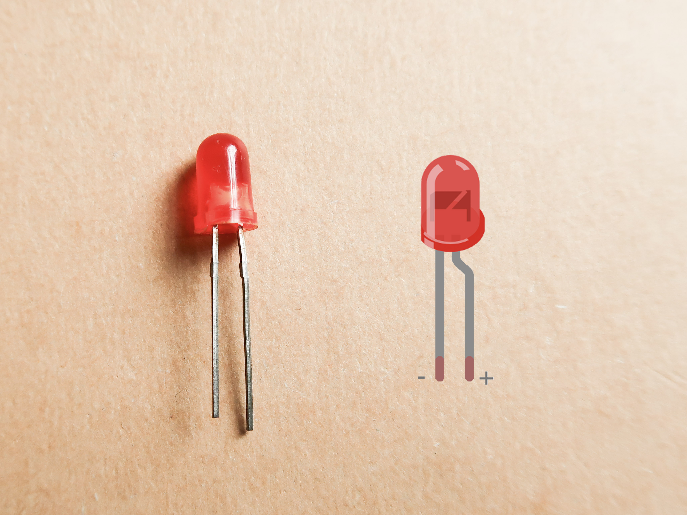
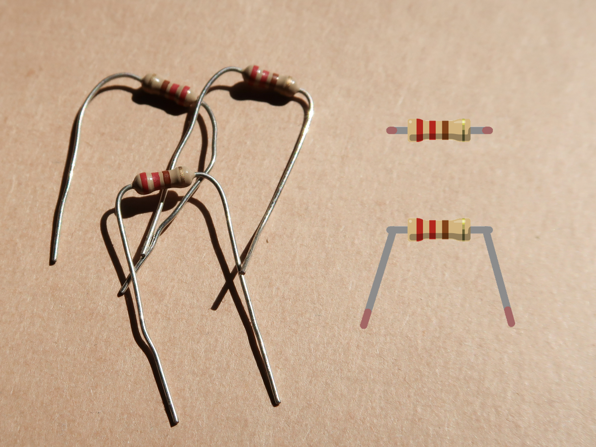
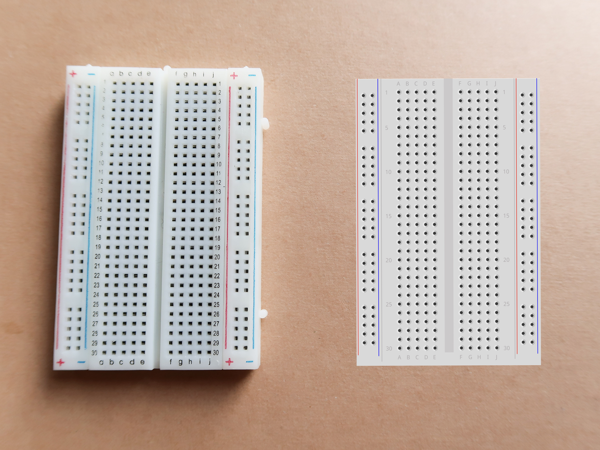
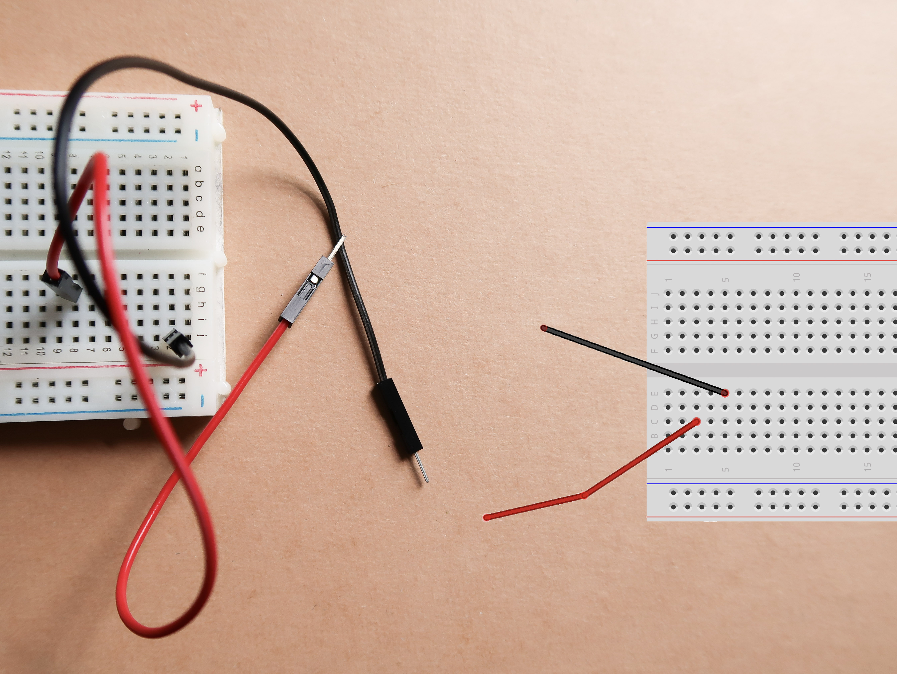
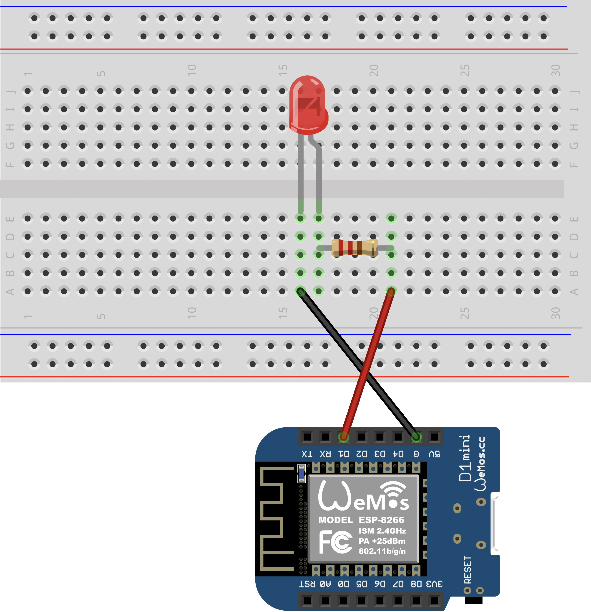

<link rel="stylesheet" href="assets/css/custom.css?v=2">

  <a href="Grundlagen1" class="button">Zurück</a>
  <a href="Grundlagen3" class="button">Weiter</a>

&nbsp;

# Grundlagen 2 – LED anschließen 💡

**In diesem Kapitel lernst du, wie du eine LED richtig anschließt und sie mit dem Arduino blinken lässt.**

**LED** bedeutet *Light Emitting Diode*. LEDs können Licht produzieren, wenn man einen Strom an sie anlegt. Dabei ist es jedoch wichtig, in welche Richtung man sie anschließt. Den Pluspol schließt man bei einer LED immer an das lange Beinchen, den Minuspol immer an das kürzere.

  

➕ Langes Bein = Pluspol  
➖ Kurzes Bein = Minuspol

Damit die LED nicht kaputtgeht, brauchst du einen **Widerstand**. Ein Widerstand ist ein elektrisches Bauteil, an dem Spannung abfällt. Er sorgt dafür, dass nicht zu viel Strom durch die LED fließt.

  

Wir bauen die Schaltung auf dem **Breadboard** auf. Das Breadboard ist der Ort, an dem Ihr Eure Schaltung aufbauen könnt. Normalerweise werden Schaltungen verlötet, damit sie lange halten. Mit einem Breadboard kann man jedoch sehr schnell Schaltungen stecken und sie auch wieder abbauen.

  

Mit den Kabel verbinden wir unsere Bauteile. Eine Konvention, an die wir uns halten wollen, ist: Alle Kabel, die zum Pluspol (*5V* / *D1* / etc.) führen, sind rot, alle Kabel, die zum Minuspol (*G* / *Gnd*) führen, sind schwarz.

🔴 Rote Kabel verbinden den Pluspol   
⚫ Schwarze Kabel verbinden den Minuspol

  

Um zu wissen, wie man Bauteile verbinden soll, kann man in den Schaltplan schauen. Dieser sieht wie folgt aus:

  

<h3>🛠️ Aufgabe</h3>
<ol>
  <li>Baue die Schaltung aus dem Schaltplan nach.</li>
  <li>Lade folgenden Code auf den Arduino hoch:
    <pre class="no-bg"><code>#define ledPin D1

void setup() {
  pinMode(ledPin, OUTPUT);
}

void loop() {
  digitalWrite(ledPin, HIGH);
  delay(500);
  digitalWrite(ledPin, LOW);
  delay(500);
}
</code></pre>
  </li>
  <li>Beobachte, was passiert. Was macht der Code?</li>
</ol>

💡 Hinweis anzeigen

<em>Wenn du nichts beobachten kannst, überprüfe bitte deine Schaltung.</em>

&nbsp;

---

  <a href="Grundlagen1" class="button">Zurück</a>
  <a href="Grundlagen3" class="button">Weiter</a>

