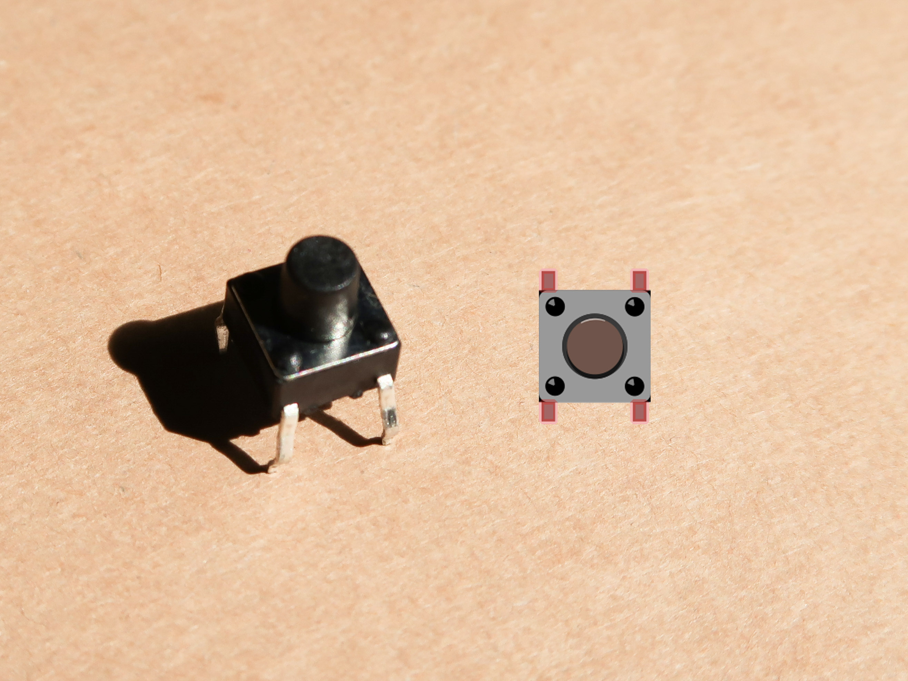
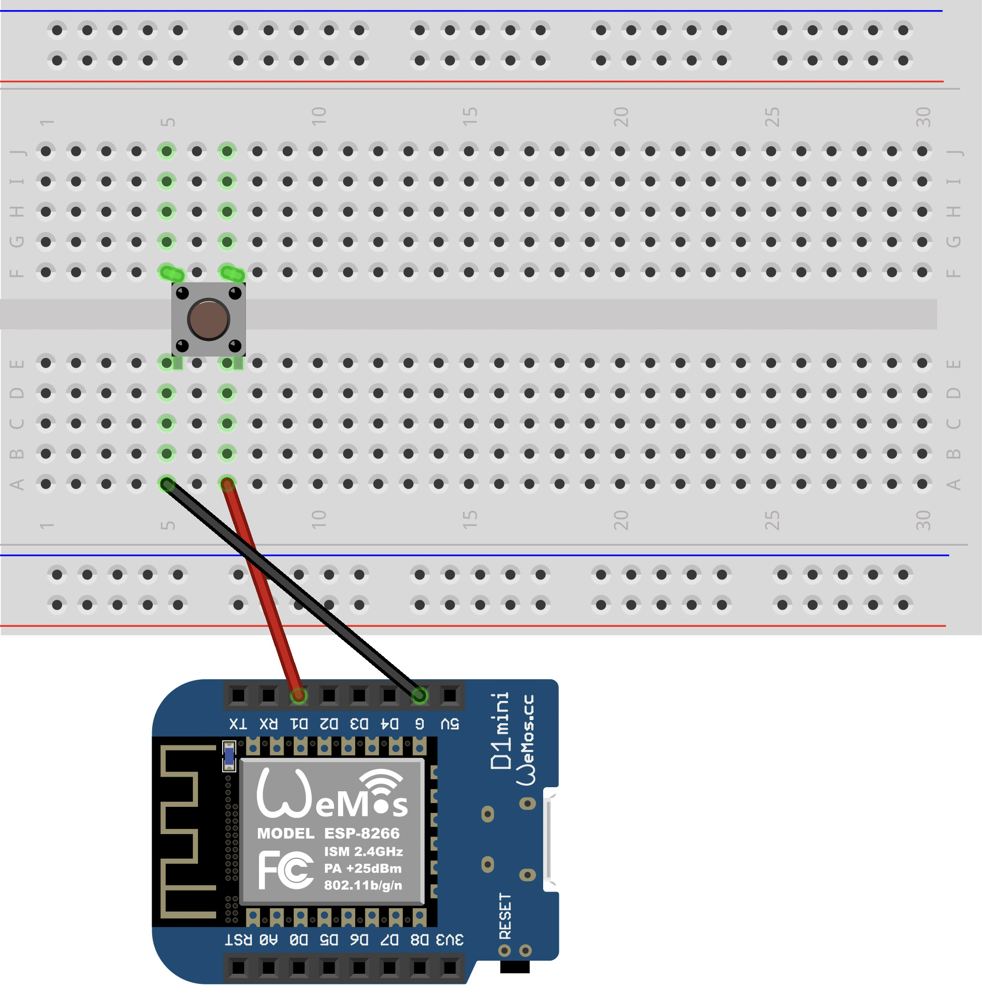
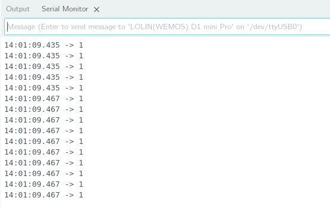

# Grundlagen 3 - Button anschließen ▶️

[Zurück zur Kapitelübersicht](Kapiteluebersicht)

**In diesem Kapitel lernst du, wie du einen Button anschließt und erkennst, ob er gedrückt ist.**

**Button** bedeutet Schalter. Mit einem Button kannst du den Stromkreis schließen oder öffnen.
Wenn du den Button drückst, wird ein Signal an den Arduino geschickt. So kannst du z. B. später Töne erzeugen oder eine LED steuern.

<p align="center"></p>

Wir verbinden den Button so, dass der Arduino erkennen kann, ob er gedrückt wird oder nicht. Dabei ist wichtig, dass du den Button mit **GND** / **G** (Minus) verbindest, damit der Pin auf `LOW` gezogen wird, wenn der Button nicht gedrückt ist.

<p align="center"></p>

> 💡 *Der Button schließt den Stromkreis nur, wenn du ihn drückst. Lässt du ihn los, ist der Stromkreis wieder offen.*

Damit wir sehen können, ob der Button gedrückt ist, geben wir den Status im Serial Monitor aus. Der Serial Monitor ist ein Fenster, in dem der Arduino Zahlen und Texte anzeigt. So kannst du genau sehen, was dein Programm gerade macht.

<p align="center"></p>

## 🛠️ Aufgabe

1. Baue die Schaltung aus dem Schaltplan nach. Achte darauf, dass ein Pin an GND angeschlossen ist. Schließe den Arduino an deinen Computer an.
2. Lade folgenden Code auf den Arduino hoch:

   ```cpp
    #define buttonPin D1

    void setup() {
    Serial.begin(9600);
    pinMode(buttonPin, INPUT_PULLUP);
    }

    void loop() {
    int buttonStatus = digitalRead(buttonPin);
    Serial.println(buttonStatus);
    }
    ```

3. Öffne den Serial Monitor in der Arduino IDE. Dafür musst du oben rechts auf das Lupensymbol klicken.
4. Drücke den Button und beobachte, welche Zahl angezeigt wird. Wenn du den Button nicht drückst, sollte 1 angezeigt werden. Wenn du den Button drückst, sollte 0 angezeigt werden. Falls keine Veränderung zu sehen ist, überprüfe die Verkabelung.

> 💡 *Warum kommt 1, wenn der Button nicht gedrückt ist?
> Wir nutzen `INPUT_PULLUP`. Das bedeutet, der Pin wird vom Arduino intern auf `HIGH` gezogen. Wenn du den Button drückst, wird der Pin auf GND gezogen – dann ist er `LOW`.*

[Weiter zu Grundlagen 4](Grundlagen4) \| [Zurück zur Kapitelübersicht](Kapiteluebersicht)