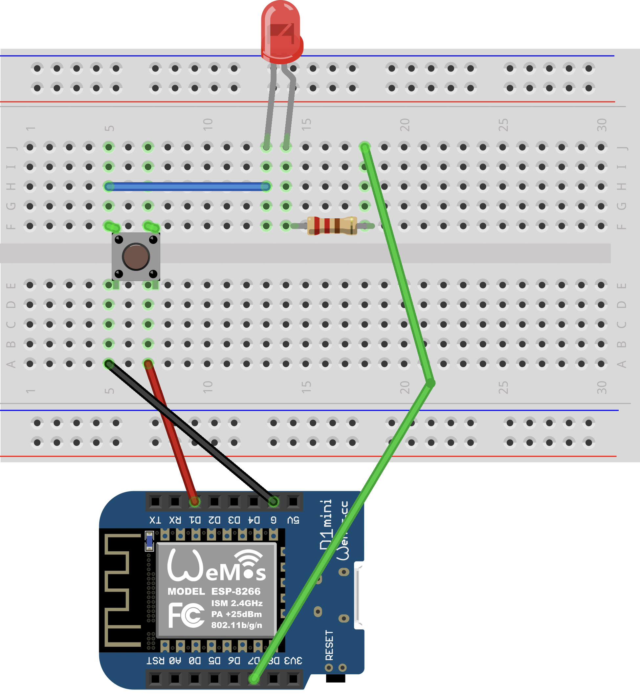

# Grundlagen 4 - Button und LED verbinden ▶️ ➕ 💡

**In diesem Kapitel lernst du, wie du den Button mit einer LED verbindest.**  

Die LED soll leuchten, solange du den Button gedrückt hältst. Damit das funktioniert, müssen wir zunächst ein neues Konzept verstehen: **Bedingungen**. Mit `if` (wenn) kannst du dem Arduino sagen:

> ***Wenn** eine Bedingung stimmt, mache etwas.*<br>
> ***Sonst** mache etwas anderes.*

**Beispiel:**

```cpp
if (hier die Bedingung) {
  // Das passiert, wenn die Bedingung stimmt
}
else {
  // Das passiert, wenn sie nicht stimmt
}
```

In unserem Fall ist die Bedingung, ob der Button gedrückt ist.

## Erste kleine Aufgabe: Status ausgeben

Bevor du die LED anschließt, probiere zunächst noch einmal folgenden Code aus, mit dem du im Serial Monitor sehen kannst, ob der Button gedrückt ist. So kannst du sicherstellen, dass deine Schaltung funktioniert, bevor du die LED anschließt.

1. **Schaltung:**  
Verwende einfach den Aufbau aus **Grundlagen 3**.

2. **Code:**
    ```cpp
    #define BUTTON_PIN D1

    void setup()
    {
      Serial.begin(9600);
      pinMode(BUTTON_PIN, INPUT_PULLUP);
    }

    void loop()
    {
      byte buttonState = digitalRead(BUTTON_PIN);
      
      if (buttonState == LOW) {
          Serial.println("Button is pressed");
      }
      else {
          Serial.println("Button is not pressed");
      }
      delay(100);
    }
    ```

3. Öffne den Serial Monitor. Drücke den Button und schaue, ob der Text sich ändert.

> 💡 *Wenn du `INPUT_PULLUP` nutzt, bedeutet das:*<br>
> Nicht gedrückt = `HIGH` (1)  
> Gedrückt = `LOW` (0)

Wenn das funktioniert, kannst du nun die LED hinzufügen. Wenn nicht, frag nochmal nach Hilfe.

<p align="center"></p>


## 🛠️ Aufgabe: LED mit dem Button steuern

Jetzt sollst du deinen eigenen Code schreiben, der die LED steuert.

1. Baue die Schaltung aus dem Schaltplan nach.  
   - Ein Pin des Buttons wird mit GND verbunden.  
   - Der andere Pin geht an D1.  
   - Die LED wird mit einem Vorwiderstand an D7 angeschlossen.  
   - Achte darauf, dass das lange Bein der LED an D7 angeschlossen ist.
2. Schreibe **deinen eigenen Code**, der folgendes tut:
   - Den Status des Buttons lesen.
   - Mit `if` prüfen, ob der Button gedrückt ist.
   - Die LED einschalten, solange der Button gedrückt ist.
   - Die LED ausschalten, wenn der Button nicht gedrückt ist.
3. Teste deine Schaltung. Drücke den Button – die LED sollte leuchten, solange du ihn gedrückt hältst.

> 💡 *Tipp: Falls du nicht weiterweißt, schaue dir den Code aus den Grundlagen 3 (Button lesen) und den Code aus den Grundlagen 2 (LED blinken) an und kombiniere beide Ideen.*


---

## ✨ Bonusaufgabe für ganz Schnelle (vielleicht zu schwer)

**Kannst du den Button so programmieren, dass die LED bei jedem Drücken umschaltet?**

**Beispiel:**
- Beim ersten Druck geht die LED an.
- Beim zweiten Druck geht sie aus.
- Beim dritten Druck wieder an.
- Und so weiter.

> 💡 *Tipp:*
>
> Dafür brauchst du:
> - Eine Variable, die speichert, ob die LED gerade an oder aus ist.
> - Eine Abfrage, ob der Button **neu gedrückt wurde** (also vom Zustand HIGH auf LOW gewechselt ist).
> - Ein Umschalten mit `digitalWrite` und `!` (Ausrufezeichen).


<a href="https://github.com/eg-lab/ThereminoKurs">Zur Übersicht der Kapitel</a>

---

## Lösungsvorschlag

```cpp
#define buttonPin D1
#define ledPin D7

void setup() {
  Serial.begin(9600);
  pinMode(buttonPin, INPUT_PULLUP);
  pinMode(ledPin, OUTPUT);
}

void loop() {
  int buttonStatus = digitalRead(buttonPin);

  if (buttonStatus == LOW) {
    digitalWrite(ledPin, HIGH);
  }
  else {
    digitalWrite(ledPin, LOW);
  }
}
```

## Lösungsvorschlag für die Bonusaufgabe

```cpp
#define buttonPin D1
#define ledPin D7

bool ledState = false;
bool lastButtonState = HIGH;

void setup() {
  pinMode(buttonPin, INPUT_PULLUP);
  pinMode(ledPin, OUTPUT);
}

void loop() {
  bool currentButtonState = digitalRead(buttonPin);

  // Prüfen, ob der Button gerade gedrückt wurde
  if (lastButtonState == HIGH && currentButtonState == LOW) {
    // LED-Zustand umschalten
    ledState = !ledState;
  }

  // LED schalten
  digitalWrite(ledPin, ledState ? HIGH : LOW);

  // Aktuellen Zustand merken
  lastButtonState = currentButtonState;

  delay(50);
}
```